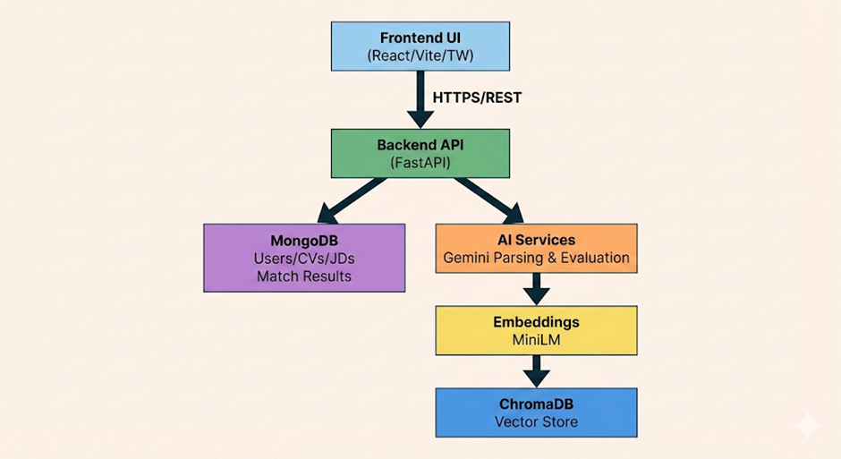
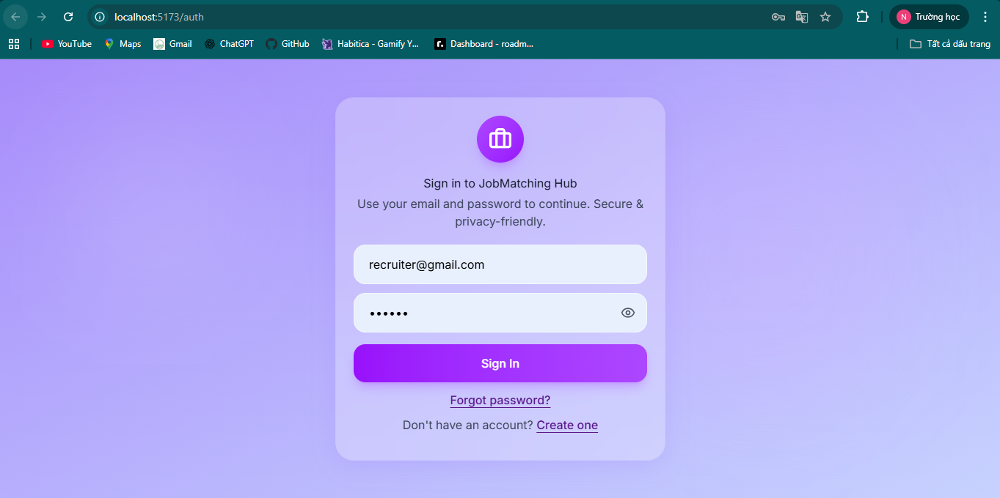
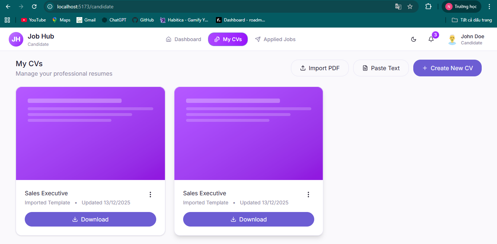
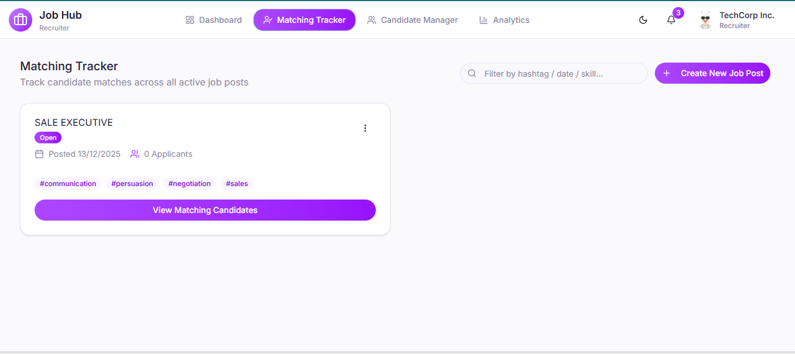
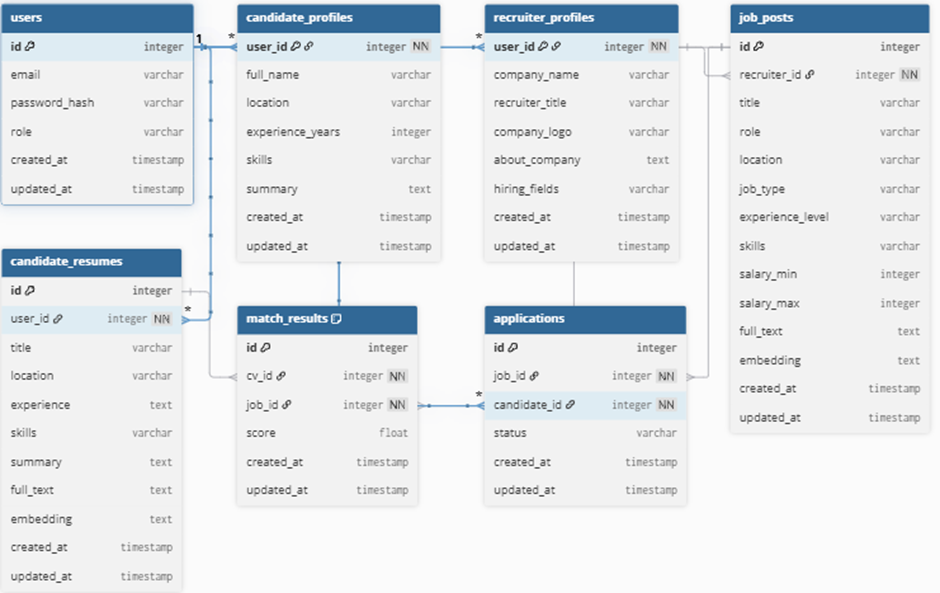

# Mastodon Job Matcher Extension

Dự án gồm backend + frontend để quản lý hồ sơ ứng viên, bài đăng tuyển dụng và thực hiện matching hai chiều. Hệ thống hỗ trợ đăng nhập, quản lý CV/JD, theo dõi ứng tuyển, và trả về kết quả matching có giải thích. README này mô tả toàn bộ sản phẩm, không chỉ riêng RAG.

## Tổng quan sản phẩm
- **Ứng viên**: tạo hồ sơ, tải CV, xem gợi ý việc làm phù hợp, theo dõi đơn ứng tuyển.
- **Nhà tuyển dụng**: tạo bài đăng, xem danh sách ứng viên phù hợp, quản lý matching và phản hồi.
- **Hệ thống matching**: tự động xếp hạng phù hợp CV ↔ JD, trả về score + lý do.

## Tính năng chính
- Xác thực người dùng, phân quyền ứng viên/nhà tuyển dụng.
- Quản lý hồ sơ ứng viên (CV chính, kỹ năng, kinh nghiệm, vị trí).
- Quản lý bài đăng tuyển dụng (role, level, location, skills, mô tả).
- Upload CV/JD từ file (PDF/DOCX/ảnh) hoặc text.
- Matching hai chiều, lưu kết quả và cho phép lọc theo điểm.
- Giao diện web để thao tác và theo dõi kết quả.

## Kiến trúc hệ thống
- **Backend**: FastAPI cung cấp API CRUD và matching.
- **Database**: MongoDB lưu user, CV, JD, match results.
- **Vector store**: ChromaDB lưu embeddings phục vụ truy hồi.
- **AI/RAG**: Gemini parse và đánh giá, SentenceTransformer tạo embeddings.
- **Frontend**: React + Vite + Tailwind + Radix UI.

## High-Level System Diagram


## RAG Matching Diagram (chi tiết)
```text
Input (CV/JD)
    |
    v
[Preprocess]
  - Read file (PDF/DOCX/Image/Text)
  - OCR nếu cần
  - Detect language + Translate EN
  - Clean + split blocks
    |
    v
[Gemini Parsing]
  CV -> {summary, experience, job_title, skills, location, full_text}
  JD -> {job_description, job_requirement, job_title, skills, location, full_text}
    |
    v
[Embedding - MiniLM]
  emb_summary / emb_experience / emb_skills / emb_full ...
    |
    v
[ChromaDB Vector Store]
  - Lưu emb_full cho ANN
  - Lưu embeddings field trong metadata
    |
    v
[Matching Pipeline]
  Stage 1: ANN Retrieval (top K)
  Stage 2: Weighted Rerank (field weights)
  Stage 3: LLM Evaluate (score + reason)
  Stage 4: Hybrid Score (ann + weighted + llm)
    |
    v
[Output]
  - Ranked list + reason
  - Lưu MatchResult vào MongoDB
```

## Luồng xử lý (tóm tắt)
1. Người dùng tải CV/JD hoặc nhập text.
2. Hệ thống preprocess, parse và lưu dữ liệu.
3. Sinh embeddings, lưu vào ChromaDB.
4. Matching: truy hồi, rerank, LLM evaluate.
5. Lưu match và hiển thị kết quả trên UI.

## Flow chart (tổng thể)
```text
Người dùng
   |
   v
Frontend UI  --->  Backend API  --->  MongoDB (CRUD)
   |                 |
   |                 v
   |             RAG Pipeline
   |                 |
   |                 v
   +------------> ChromaDB (Vector Store)
                     |
                     v
                Kết quả matching
                     |
                     v
                 Hiển thị UI
```

## Use case chính
### Ứng viên
- Đăng ký/đăng nhập.
- Tạo hồ sơ ứng viên.
- Upload CV (PDF/DOCX/ảnh) hoặc nhập text.
- Xem gợi ý việc làm phù hợp.
- Theo dõi đơn ứng tuyển đã gửi.

### Nhà tuyển dụng
- Đăng ký/đăng nhập.
- Tạo hồ sơ nhà tuyển dụng.
- Đăng bài tuyển dụng.
- Chạy matching tìm ứng viên phù hợp.
- Xem danh sách ứng viên + lý do phù hợp.
- Quản lý phản hồi và trạng thái.

## Cấu trúc UI (tóm tắt)
- **AuthPage**: Đăng nhập/đăng ký/quên mật khẩu.
  
- **OnBoardingPage**: Chọn vai trò (Candidate/Recruiter).
- **CandidatePage**:
  
- **RecruiterPage**:
  

## Cấu trúc database


- **User**: thông tin tài khoản và vai trò.
- **CV**: title, location, experience, skills, summary, full_text, pdf_url.
- **JD**: title, role, location, job_type, experience_level, skills, salary.
- **MatchResult**: cv_id, job_id, score, metadata, timestamps.

## API chính
- `POST /api/matching/job/{job_id}/run`
- `POST /api/matching/cv/{cv_id}/run`
- `GET /api/matching/job/{job_id}/matches`
- `GET /api/matching/cv/{cv_id}/matches`

## Công nghệ chính
- Backend: FastAPI, Uvicorn, MongoDB (Beanie/Motor).
- AI/RAG: Gemini API, SentenceTransformers (MiniLM), LlamaIndex, ChromaDB.
- OCR/Parse: PyMuPDF, pytesseract, docx2txt, langdetect.
- Frontend: React + Vite + TypeScript + Tailwind + Radix UI.

## Cấu trúc thư mục hiện tại
```text
.
├── backend/         # FastAPI backend + RAG pipeline
├── frontend/        # Frontend workspace (hiện chưa có source files)
├── docs/            # HLD/LLD và agent rules
└── asset/           # Hình ảnh minh họa README
```

## Cấu hình môi trường
Tạo file `.env` trong `backend/`:

```env
GEMINI_API_KEY=your_api_key_here
OPENAI_API_KEY=
MASTODON_API_BASE_URL=
MASTODON_ACCESS_TOKEN=
```

## Chạy hệ thống
### Backend
```bash
cd backend
python -m venv .venv
source .venv/bin/activate   # macOS/Linux
# hoặc: .venv\Scripts\activate  # Windows
pip install -r requirements.txt
python main.py
```

Backend chạy ở `http://localhost:8000`.

### Frontend
Thư mục `frontend/` hiện chưa có source code để chạy app. Khi frontend được thêm vào, có thể dùng luồng Vite chuẩn:

```bash
cd frontend
npm install
npm run dev
```

Frontend dự kiến chạy ở `http://localhost:5173`.

## Ghi chú
- ChromaDB lưu local tại `backend/ragmodel/vector_store`.
- MongoDB mặc định: `mongodb://localhost:27017`, DB `job_matching`.
- CORS backend hiện mở cho `http://localhost:5173` và `http://127.0.0.1:5173`.
- Nếu chỉ cần chi tiết pipeline AI, xem `backend/README.md`.
