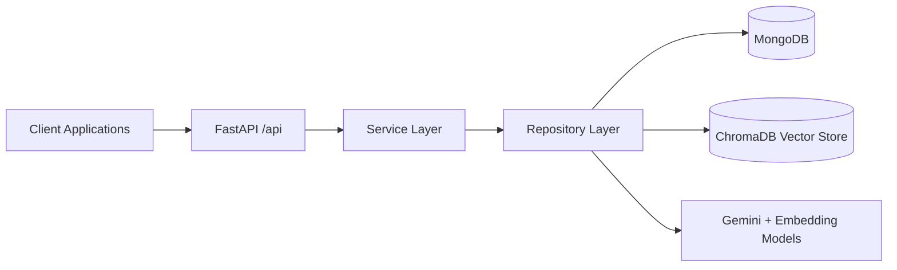

# Backend HLD: Overview and Problem

## Purpose
This HLD pack explains how the backend solves CV-JD matching in the current implementation.

## Problem Statement
Job matching must support two directions with explainable ranking:
- JD to CV: recruiters find best candidate resumes for a job.
- CV to JD: candidates find best matching jobs for a resume.

The system needs:
- semantic retrieval over unstructured text,
- ranking quality better than pure vector similarity,
- a persisted match result set for fast read APIs,
- transparent reasoning for why two documents match.

## Scope
In scope:
- backend runtime architecture,
- matching pipeline and scoring strategy,
- data ownership and persistence boundaries,
- matching-related API flows.

Out of scope:
- frontend UX and state management,
- infra deployment topology,
- business policy decisions not represented in code.

## Core Design Principles
- Separate online retrieval infrastructure from business record storage.
- Keep APIs stable through router -> service -> repository layering.
- Make ranking multi-stage: retrieve broadly, rerank precisely, explain with LLM.
- Persist final match outcomes for low-latency list/read use cases.

## System Context

## Component I/O Table
| Component | Input | Output | Dependencies |
| --- | --- | --- | --- |
| Client Applications | HTTP requests | API calls for upload/match/read | Backend OpenAPI |
| FastAPI `/api` | Request payloads | Validated responses | Routers, schemas |
| Service Layer | Use-case calls | Business responses | Repositories |
| Repository Layer | Domain operations | DB + vector operations | MongoDB, Chroma, ragmodel |
| MongoDB | CRUD and match persistence | Business entities, match records | Beanie models |
| ChromaDB | Embeddings and metadata | ANN candidate sets | Chroma persistent client |
| Gemini + Embedding Models | JD/CV text | Parsed fields, reasoning score, embeddings | API key, model runtime |

## What "Solved" Means for Matching
A matching run is considered successful when:
- candidates are retrieved in both directions (JD->CV and CV->JD),
- results include hybrid scores and reason metadata,
- high-scoring pairs are persisted in `match_results`,
- read APIs can return ranked matches with enriched CV/Job summaries.

## Related LLD (Load only if needed)
Strict rule: only load these LLD files when the current task requires low-level implementation detail that HLD does not cover.
- index and ownership map -> `docs/backend/LLD/00-index.md`
- app bootstrap and router map -> `docs/backend/LLD/runtime/app-bootstrap-and-router-map.md`
- endpoint/schema matrix -> `docs/backend/LLD/api/backend-endpoint-schema-matrix.md`
- cross-store consistency and failure modes -> `docs/backend/LLD/data/cross-store-consistency-and-failure-modes.md`

## References
- Architecture mapping: `docs/backend/HLD/10-architecture-overview.md`
- Pipeline details: `docs/backend/HLD/20-matching-pipeline.md`
- Data boundaries: `docs/backend/HLD/30-data-and-storage.md`
- Runtime and API flows: `docs/backend/HLD/40-api-and-runtime-flows.md`
