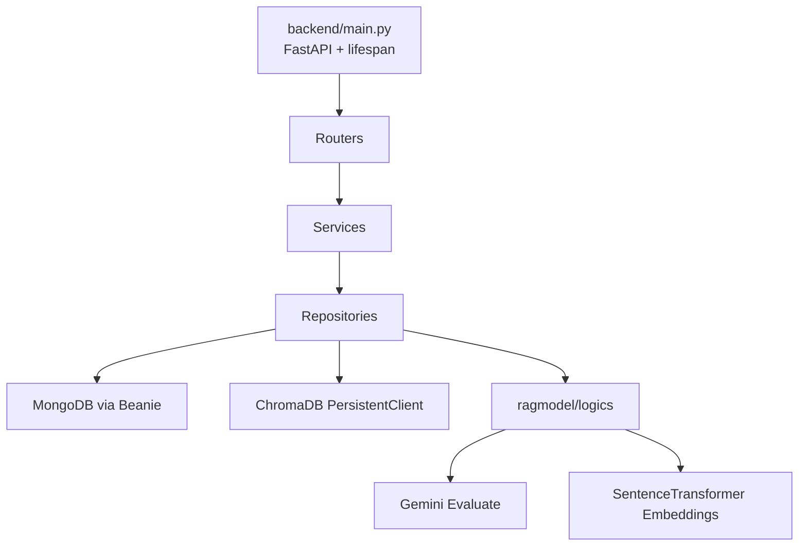

# Backend HLD: Architecture Overview

## Runtime Layers
The backend follows a layered API architecture:
- Router layer: endpoint contracts and validation bindings.
- Service layer: use-case orchestration and response shaping.
- Repository layer: persistence and matching engine integration.
- ragmodel layer: parsing, embedding, retrieval, rerank, LLM evaluation.

## Main Runtime Components

## Component I/O Table
| Component | Input | Output | Dependencies |
| --- | --- | --- | --- |
| `main.py` app | startup lifecycle | mounted `/api` routers | `init_db`, router modules |
| Routers | HTTP requests | service calls + response models | Pydantic schemas |
| Services | endpoint intents | repository operations + composed payloads | repository classes |
| Repositories | domain operations | DB writes/reads, vector ops | Beanie docs, ragmodel |
| ragmodel | parsed JSON/text | candidate lists + scores + reasons | ChromaDB, Gemini, embeddings |

## Responsibility Boundaries
- Routers do not implement ranking logic.
- Services do not directly access vector store collections.
- Repositories bridge business entities and AI matching internals.
- ragmodel contains retrieval and ranking algorithm details.

## Key Integration Paths
1. Ingestion path:
- upload endpoint -> service -> repository -> preprocess/parse/embed -> store in Chroma and Mongo.

2. Matching execution path:
- run endpoint -> service -> repository matcher -> hybrid score -> `match_results` upsert.

3. Match query path:
- list endpoint -> service -> repository read -> on-the-fly enrichment with CV/Job summaries.

## Matching V2 Run-Only Prototype Override

The runtime layers above describe the legacy/current production matching system. Matching V2 run-only prototype is intentionally narrower and overrides that path for `/api/v2/prototype/matching/*`.

V2 prototype path:
- API namespace: `/api/v2/prototype/matching`.
- Runtime storage: PostgreSQL tables `job_posts_v2`, `candidate_profiles_v2`, `job_embeddings_v2`, `candidate_embeddings_v2`.
- Vector storage/scoring: pgvector in PostgreSQL.
- Execution model: load anchor and candidate pool from PostgreSQL, apply hard filters, score exhaustively, rerank deterministically, return response directly.

V2 prototype exclusions:
- No MongoDB or ChromaDB dependency for prototype JD/CV matching data.
- No Gemini/LLM evaluation stage.
- No persisted match result table, including `match_results_v2`.
- No GET/DELETE persisted match result APIs.
- No old-vs-v2 comparison or legacy route deprecation.

For V2 implementation tasks, use `docs/REQUIREMENTS.md`, `docs/backend/HLD/20-matching-pipeline.md`, `docs/backend/HLD/30-data-and-storage.md`, `docs/backend/HLD/40-api-and-runtime-flows.md`, and `docs/matching-v2-scenario-test-cases.md` as the relevant architecture sources before loading legacy matching LLDs.

## Non-Goals of This Layering
- No event bus or async queue orchestration in current implementation.
- No separate model-serving microservice.
- No strict tenancy boundary enforcement in matching routes today.

## Important Operational Dependency
Legacy/current production matching LLM evaluation depends on Gemini availability. If unavailable, that pipeline falls back to vector-driven proxy scoring for the LLM slot.

Matching V2 run-only prototype does not use Gemini or any LLM stage.

## Related LLD (Load only if needed)
Strict rule: only load these LLD files when the current task requires low-level implementation detail that HLD does not cover.
- app bootstrap and router map -> `docs/backend/LLD/runtime/app-bootstrap-and-router-map.md`
- router contract and error patterns -> `docs/backend/LLD/runtime/router-contract-and-error-patterns.md`
- user auth and role flow -> `docs/backend/LLD/identity/user-auth-and-role-flow.md`
- candidate profile flow -> `docs/backend/LLD/identity/candidate-profile-flow.md`
- recruiter profile flow -> `docs/backend/LLD/identity/recruiter-profile-flow.md`
- CV manual and upload flows -> `docs/backend/LLD/cv/cv-manual-crud-and-main-cv-flow.md`, `docs/backend/LLD/cv/cv-upload-parse-embed-store-flow.md`
- Job manual and upload flows -> `docs/backend/LLD/jobs/job-manual-crud-flow.md`, `docs/backend/LLD/jobs/job-upload-parse-embed-store-flow.md`

## References
- Matching internals: `docs/backend/HLD/20-matching-pipeline.md`
- Data ownership: `docs/backend/HLD/30-data-and-storage.md`
