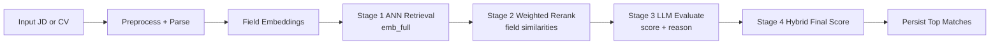

# Backend HLD: Matching Pipeline

## Goal
Produce high-quality, explainable ranking for JD-CV pairs using multi-stage hybrid scoring.

## Directional Modes
- JD to CV: `get_top_k_cvs_for_jd(...)`
- CV to JD: `get_top_k_jds_for_cv(...)`

Both use the same stage pattern and hybrid weights.

## End-to-End Pipeline

## Component I/O Table
| Stage | Input | Output | Notes |
| --- | --- | --- | --- |
| Preprocess + Parse | PDF/text | structured JD/CV fields | parser fills `full_text` when missing |
| Embedding | structured fields | field embeddings (`emb_*`) | full + per-field vectors |
| ANN retrieval | query `emb_full` | broad candidate set | vector nearest neighbors |
| Weighted rerank | candidate embeddings | `weighted_sim` | weighted field cosine aggregation |
| LLM evaluate | JD text + CV text | `llm_score`, `reason` | Gemini reasoning step |
| Hybrid final score | ANN + weighted + LLM | final sortable score | normalized to `[0,1]` |
| Persist | scored pairs | `match_results` rows | threshold + top-K policy |

## Scoring Formula (Implemented)
Final score uses:
- ANN cosine: 0.2
- Weighted similarity: 0.5
- LLM score normalized to `[0,1]`: 0.3

Formula:
`final = 0.2 * cosine_ann + 0.5 * weighted_sim + 0.3 * (llm_score / 100)`

## Weighted Field Similarity
Field mapping uses CV/JD embedding pairs:
- skills
- experience requirement
- summary/job description
- job title
- full text
- location

Current weights:
- skills: 0.30
- experience_requirement: 0.25
- summary_description: 0.20
- job_title: 0.15
- full: 0.05
- location: 0.05

## Failure Modes and Fallbacks
- Missing embeddings for a candidate: candidate is skipped.
- LLM evaluation failure:
  - `llm_score` fallback to `weighted_sim * 100`
  - reason set to vector-similarity fallback message.
- ANN query empty: returns empty result set safely.

## Persistence Policy in MatchingService
- Execute matching with configurable `top_k` and `min_score`.
- Upsert each qualifying pair in `match_results`.
- Delete records outside top-K for that anchor entity (job or CV).

## Why This Solves the Problem Better Than Single-Stage Ranking
- ANN retrieval gives recall over large candidate space.
- Weighted rerank injects domain relevance by field importance.
- LLM adds semantic judgment and explanation.
- Hybrid score balances speed, precision, and explainability.

## Related LLD (Load only if needed)
Strict rule: only load these LLD files when the current task requires low-level implementation detail that HLD does not cover.
- matching core algorithm details -> `docs/backend/LLD/matching/matching-core-algorithm-details.md`
- matching orchestration and top-k sync -> `docs/backend/LLD/matching/matching-orchestration-and-topk-sync.md`
- match query enrichment and cleanup -> `docs/backend/LLD/matching/match-query-enrichment-and-cleanup-flows.md`
- resume preprocess and parse details -> `docs/backend/LLD/rag/resume-preprocess-and-parse-details.md`
- job preprocess and parse details -> `docs/backend/LLD/rag/job-preprocess-and-parse-details.md`
- embedding and Chroma metadata contract -> `docs/backend/LLD/rag/embedding-and-chromadb-metadata-contract.md`

## References
- Runtime architecture: `docs/backend/HLD/10-architecture-overview.md`
- Persistence model: `docs/backend/HLD/30-data-and-storage.md`
