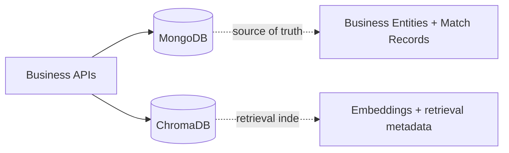

# Backend HLD: Data and Storage Boundaries

## Storage Roles
The backend uses two storage systems with distinct ownership.

## Ownership Model

## Component I/O Table
| Store | Input | Output | Ownership |
| --- | --- | --- | --- |
| MongoDB | CRUD writes, match upserts | canonical business records | users, CVs, jobs, applications, persisted matches |
| ChromaDB | embedding vectors + metadata | ANN retrieval candidates | semantic index infrastructure only |

## MongoDB Entities Relevant to Matching
- `candidate_resumes` (`CandidateResume`)
- `job_posts` (`JobPost`)
- `match_results` (`MatchResult`)

`MatchResult` persists:
- `cv_id`, `job_id`
- `score`
- metadata (`cosine_ann`, `weighted_sim`, `llm_score`, `reason`)
- timestamps

Index intent for `match_results`:
- unique pair `(cv_id, job_id)`
- sorted retrieval by score per CV and per Job

## ChromaDB Collections
- `cv_full`
- `jd_full`

Each record stores:
- primary retrieval vector (`emb_full`)
- serialized field embeddings in metadata
- matching-relevant text fields (`full_text`, summary/requirements, etc.)

## Synchronization Points
1. Upload CV/JD:
- parse and embed content,
- write business record to MongoDB,
- write vector + metadata to ChromaDB.

2. Delete CV/JD:
- remove vectors from ChromaDB,
- remove entity from MongoDB.

3. Run matching:
- read candidates from ChromaDB,
- compute final score,
- upsert compact match record to MongoDB.

## Read-Time Enrichment
Stored match rows are intentionally compact.
When querying matches:
- service reads ranked rows from `match_results`,
- service enriches each row with current CV/Job summary fields.

This avoids duplicating full CV/JD payloads inside `match_results`.

## Consistency Considerations
- Cross-store operations are not transactional.
- Temporary divergence can occur if one write succeeds and another fails.
- Current strategy favors operational simplicity with graceful retries and safe fallback reads.

## Related LLD (Load only if needed)
Strict rule: only load these LLD files when the current task requires low-level implementation detail that HLD does not cover.
- MongoDB model ID and index contracts -> `docs/backend/LLD/data/mongodb-model-id-and-index-contracts.md`
- cross-store consistency and failure modes -> `docs/backend/LLD/data/cross-store-consistency-and-failure-modes.md`
- embedding and Chroma metadata contract -> `docs/backend/LLD/rag/embedding-and-chromadb-metadata-contract.md`
- matching orchestration and top-k sync -> `docs/backend/LLD/matching/matching-orchestration-and-topk-sync.md`

## References
- Pipeline flow: `docs/backend/HLD/20-matching-pipeline.md`
- API runtime flow: `docs/backend/HLD/40-api-and-runtime-flows.md`
