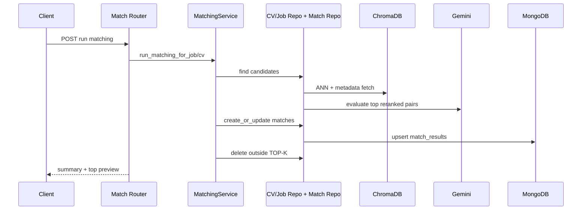
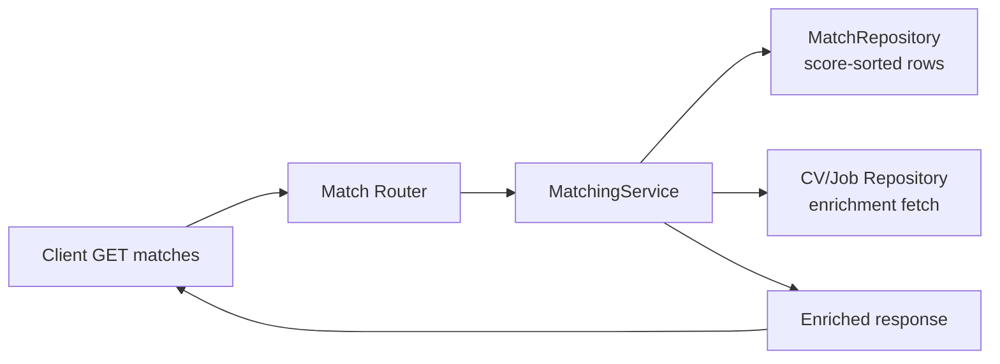

# Backend HLD: API Surface and Runtime Flows

## Matching-Relevant API Surface
Primary matching endpoints under `/api/matching`:
- `POST /matching/job/{job_id}/run`
- `POST /matching/cv/{cv_id}/run`
- `GET /matching/job/{job_id}/matches`
- `GET /matching/cv/{cv_id}/matches`
- `DELETE /matching/job/{job_id}/matches`
- `DELETE /matching/cv/{cv_id}/matches`

Additional direct match endpoints:
- `GET /cv/match/{cv_id}/jobs`
- `GET /jobs/match/{job_id}/cvs`

## Run-Matching Flow

## Component I/O Table
| Component | Input | Output | Key contract |
| --- | --- | --- | --- |
| Match Router | run/query/delete requests | typed response models | `RunMatchingResponse`, list wrappers |
| MatchingService | validated params (`top_k`, `min_score`) | persisted and previewed matches | score threshold + top-K cleanup |
| CV/Job Repositories | entity ids | directional match candidates | bridge to ragmodel matcher |
| MatchRepository | scored pair records | upserted/fetched/deleted rows | unique `(cv_id, job_id)` pair |

## Match Retrieval Flow

## Runtime Behavior Notes
- `min_score` controls persistence and query filtering.
- `top_k` controls retained set size per anchor job/CV.
- Enrichment is query-time only; enriched objects are not stored in `match_results`.
- Error handling returns safe responses or HTTP error payloads from router boundaries.

## Operational Limits
- LLM latency can dominate matching runtime.
- Rate limits can impact large batches.
- Route-level auth/tenant enforcement is limited in current baseline.

## Related LLD (Load only if needed)
Strict rule: only load these LLD files when the current task requires low-level implementation detail that HLD does not cover.
- backend endpoint/schema matrix -> `docs/backend/LLD/api/backend-endpoint-schema-matrix.md`
- app bootstrap and router map -> `docs/backend/LLD/runtime/app-bootstrap-and-router-map.md`
- router contract and error patterns -> `docs/backend/LLD/runtime/router-contract-and-error-patterns.md`
- matching orchestration and top-k sync -> `docs/backend/LLD/matching/matching-orchestration-and-topk-sync.md`
- match query enrichment and cleanup -> `docs/backend/LLD/matching/match-query-enrichment-and-cleanup-flows.md`
- application create/query/status flow -> `docs/backend/LLD/applications/application-create-query-status-flow.md`
- application delete drift note -> `docs/backend/LLD/applications/application-delete-flow-drift-note.md`

## References
- Architecture context: `docs/backend/HLD/10-architecture-overview.md`
- Scoring and stages: `docs/backend/HLD/20-matching-pipeline.md`
